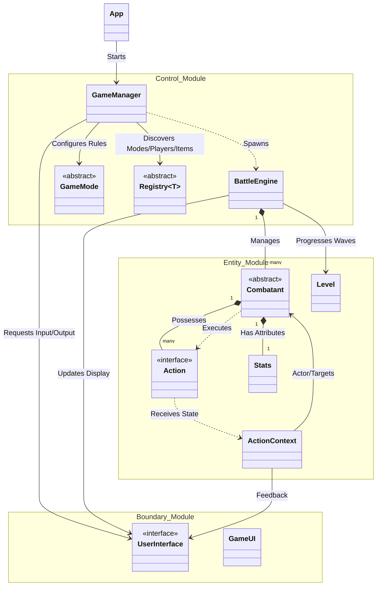

# Project Architecture: High-Level Overview

This project follows the **Boundary-Control-Entity (BCE)** architectural pattern, ensuring a clean separation between the user interface, the game logic, and the core domain models.

### Module Interactions

| Module | Primary Responsibility | Key Bridge Classes |
| :--- | :--- | :--- |
| **Boundary** | Handles all I/O, terminal formatting, and theme management. | `UserInterface` |
| **Control** | Orchestrates game flow, battle sequencing, and object discovery. | `GameManager`, `BattleEngine` |
| **Entity** | Contains the core domain logic, combat mechanics, and data models. | `Combatant`, `Action`, `Level` |

### Core Architectural Patterns
1.  **Facade (`UserInterface`)**: The Control module interacts only with the `UserInterface` interface, allowing the entire UI implementation (`GameUI`) to be swapped or modified without affecting game logic.
2.  **Strategy (`Action`, `TurnOrderStrategy`)**: Combat behaviors and turn sequencing are encapsulated as interchangeable strategies, allowing for highly varied combatant abilities.
3.  **Command (`Action`, `Item`)**: Actions and Items are treated as commands that receive an `ActionContext` to execute their logic against the game state.
4.  **Observer (`StatusManager`)**: Status effects subscribe to combat events and modify behavior dynamically during the battle cycle.

---

*For detailed class hierarchies and internal module logic, please refer to the specific diagrams in the `class_diagrams/` folder:*
- [Boundary Module](./class_diagrams/boundary_class_diagram.md)
- [Control Module](./class_diagrams/control_class_diagram.md)
- [Action Module](./class_diagrams/action_class_diagram.md)
- [Combatant Module](./class_diagrams/combatant_class_diagram.md)
- [Effect Module](./class_diagrams/effect_class_diagram.md)
- [Equipment Module](./class_diagrams/equipment_class_diagram.md)
- [Item Module](./class_diagrams/item_class_diagram.md)
- [Level Module](./class_diagrams/level_class_diagram.md)
