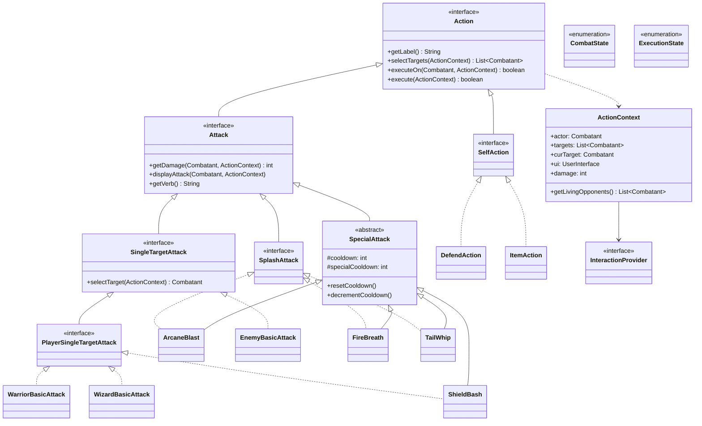

# Entity Action Module Class Diagram

The `entity.action` module defines the behavior of all combatants, including attacks, defensive maneuvers, and item usage.

### Module Responsibilities:
- **`Action` Hierarchy**: Uses the Strategy and Command patterns to define combat behaviors independently of the `Combatant` classes.
- **`Attack` Hierarchy**: Specialized logic for damage calculation, hit detection, and visual display of offensive moves.
- **`SpecialAttack`**: Adds resource management (cooldowns) to the basic attack logic.
- **`ActionContext`**: A parameter object that encapsulates all external dependencies (UI, state, targets) required to execute an action, ensuring that action implementations remain "pure" and decoupled.
- **`SelfAction` / `SingleTargetAttack` / `SplashAttack`**: These interfaces define the targeting logic (who is affected) separate from the execution logic (what happens).
