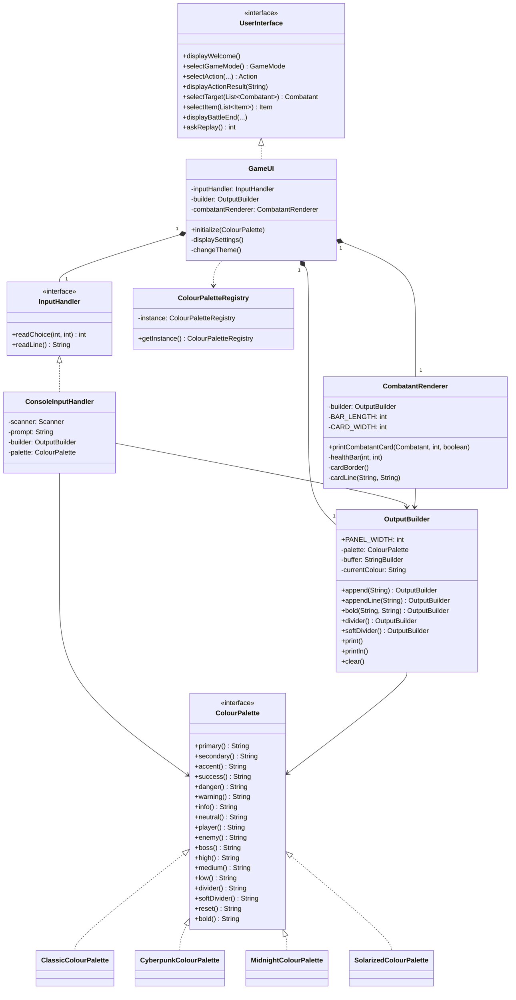

# Boundary Module Class Diagram

The boundary module handles all user interaction, including input reading, output formatting, and visual rendering.

### Module Responsibilities:
- **`UserInterface` & `GameUI`**: The primary facade for all user-facing operations.
- **`InputHandler` & `ConsoleInputHandler`**: Encapsulates user input logic, providing validation and error handling.
- **`OutputBuilder`**: A fluent API for building complex, colored terminal output with support for ANSI escapes.
- **`CombatantRenderer`**: Specialized logic for drawing character cards, health bars, and ASCII art.
- **`ColourPalette`**: Defines the visual theme of the application, allowing for runtime theme switching via different implementations.
