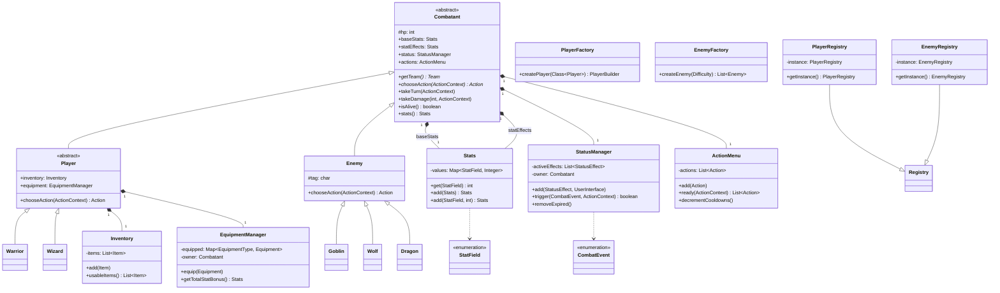

# Entity Combatant Module Class Diagram

The `entity.combatant` module contains the core character models, their stat management, status effect handling, and character-creation factories.

### Module Responsibilities:
- **`Combatant`**: The foundational abstraction for anything that can participate in battle. It handles health, turn execution, and delegating stats/status logic to specialized helpers.
- **`Player` vs `Enemy`**: Players support equipment and inventory systems and rely on user input for actions. Enemies use simple AI (or fixed logic) and have unique tag identifiers.
- **Stat System (`Stats`, `StatField`)**: Decouples numerical data from the combatants. Supports additive bonuses, making it easy to stack effects and equipment.
- **Status System (`StatusManager`, `CombatEvent`)**: An event-driven system that allows status effects to hook into various points in the turn cycle (e.g., `TURN_START`, `DAMAGE_TAKEN`).
- **Factories & Registries**: Centralizes character creation, ensuring that complex objects (like a Player with starting items and gear) are built consistently.
