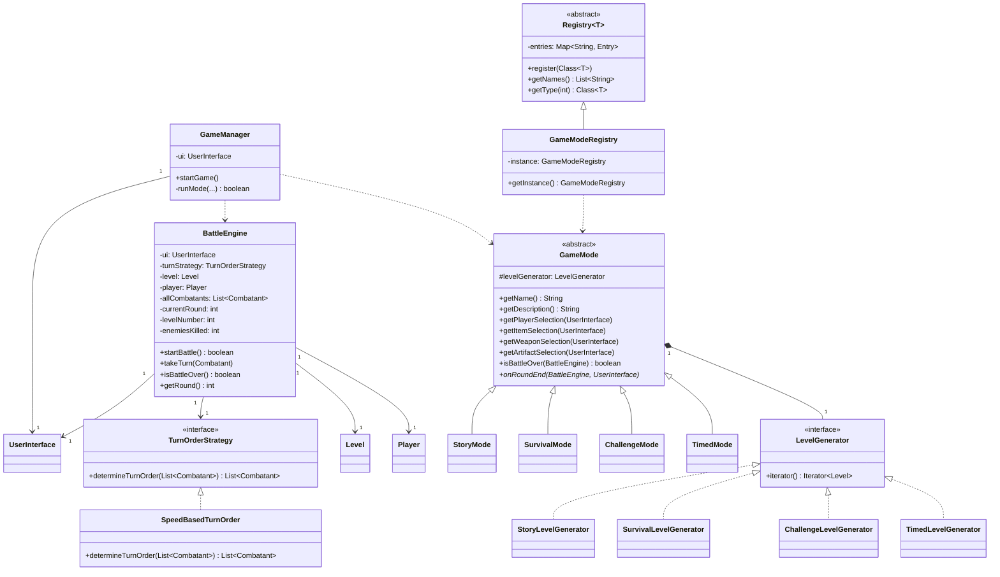

# Control Module Class Diagram

The control module orchestrates the game flow, manages battle logic, and defines different game modes.

### Module Responsibilities:
- **`GameManager`**: The top-level orchestrator. It manages the main game loop, setup, and mode transitions.
- **`BattleEngine`**: The core logic engine for combat encounters. It handles turn sequencing, wave spawning, and win/loss detection.
- **`GameMode`**: An abstraction representing a specific gameplay experience (e.g., fixed loadout, endless waves). It delegates level generation to a `LevelGenerator`.
- **`Registry`**: A generic system for dynamically discovering and creating game components (players, modes, items) at runtime.
- **`TurnOrderStrategy`**: Employs the Strategy pattern to allow different ways of calculating turn sequences (e.g., speed-based, initiative-based).
