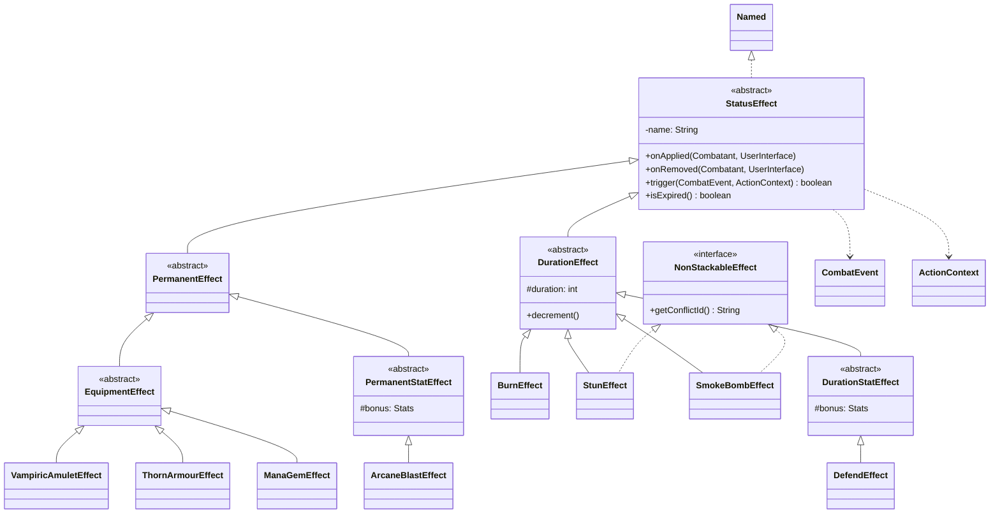

# Entity Effect Module Class Diagram

The `entity.effect` module provides a flexible, event-driven system for applying temporary or permanent status changes to combatants.

### Module Responsibilities:
- **`StatusEffect` Hierarchy**: Implements an Observer-like pattern where effects "subscribe" to combat events (e.g., `TURN_START`, `DAMAGE_TAKEN`) and can modify or cancel actions.
- **Stat Modification**: `DurationStatEffect` and `PermanentStatEffect` provide a clean way to apply temporary or permanent buffs/debuffs that are automatically calculated into a combatant's total stats.
- **Stacking Logic**: The `NonStackableEffect` interface allows the system to identify and resolve conflicts when multiple effects of the same type are applied to the same combatant.
- **Equipment Integration**: `EquipmentEffect` allows specialized gear to inject custom logic into the combat cycle (e.g., reflecting damage or restoring mana on specific triggers).
