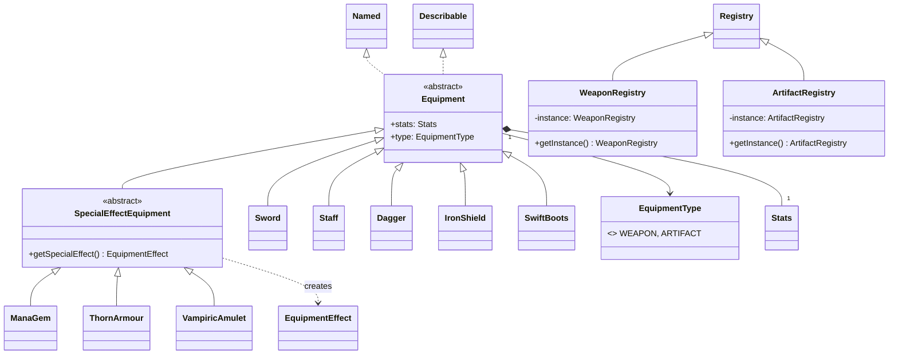

# Entity Equipment Module Class Diagram

The `entity.equipment` module manages items that provide persistent stat bonuses and special combat effects to players.

### Module Responsibilities:
- **`Equipment`**: The base class for all equippable items. It uses composition for stat bonuses, allowing gear to modify any combination of attributes (ATK, DEF, SPD, etc.).
- **`SpecialEffectEquipment`**: An extension that allows gear to hook into the `entity.effect` system. This enables "intelligent" gear that reacts to combat events (e.g., life-steal, mana recovery, or damage reflection).
- **`Weapon` vs `Artifact`**: Differentiated by the `EquipmentType` enum, which determines which "slot" the item occupies in the `EquipmentManager`.
- **Registries**: Provides a centralized way to browse and select equipment during the player loadout phase.
