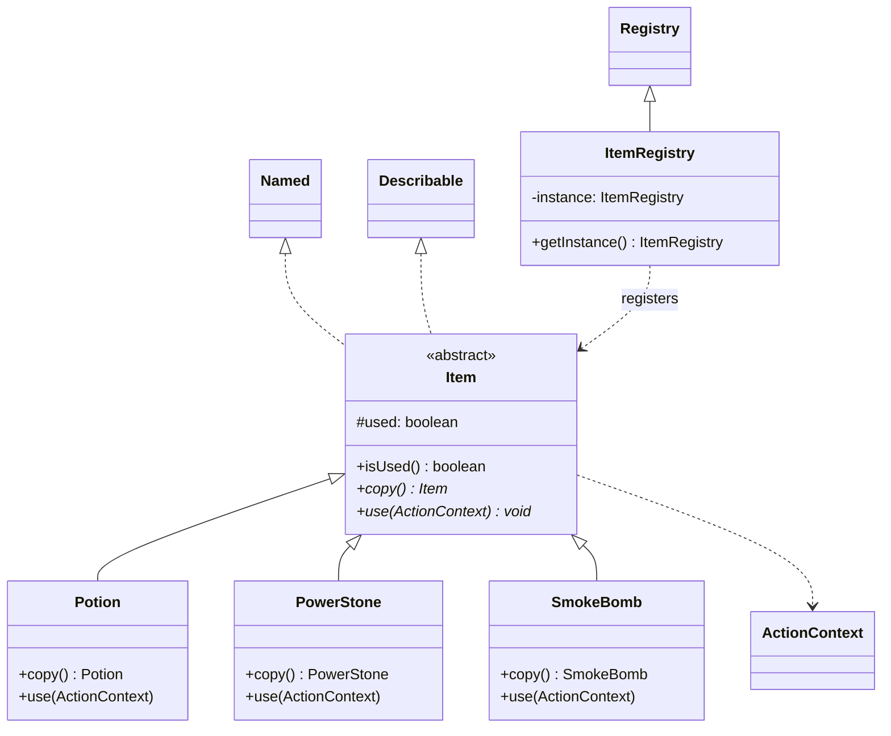

# Entity Item Module Class Diagram

The `entity.item` module defines consumable resources that players can use during their turn to gain immediate advantages.

### Module Responsibilities:
- **`Item`**: An abstract base for all consumable goods. It uses the Prototype pattern (`copy()`) to ensure that when a player selects items from a registry, they receive fresh, independent instances.
- **`use(ActionContext)`**: Employs the Command pattern. Items receive the full combat context, allowing them to modify HP (Potion), apply permanent stat buffs (PowerStone), or apply complex status effects (SmokeBomb).
- **`used` state**: Tracks whether an item has been consumed, ensuring it is removed from the player's inventory after use.
- **`ItemRegistry`**: A central catalog of all available items, used during the loadout phase to populate a player's starting inventory.
