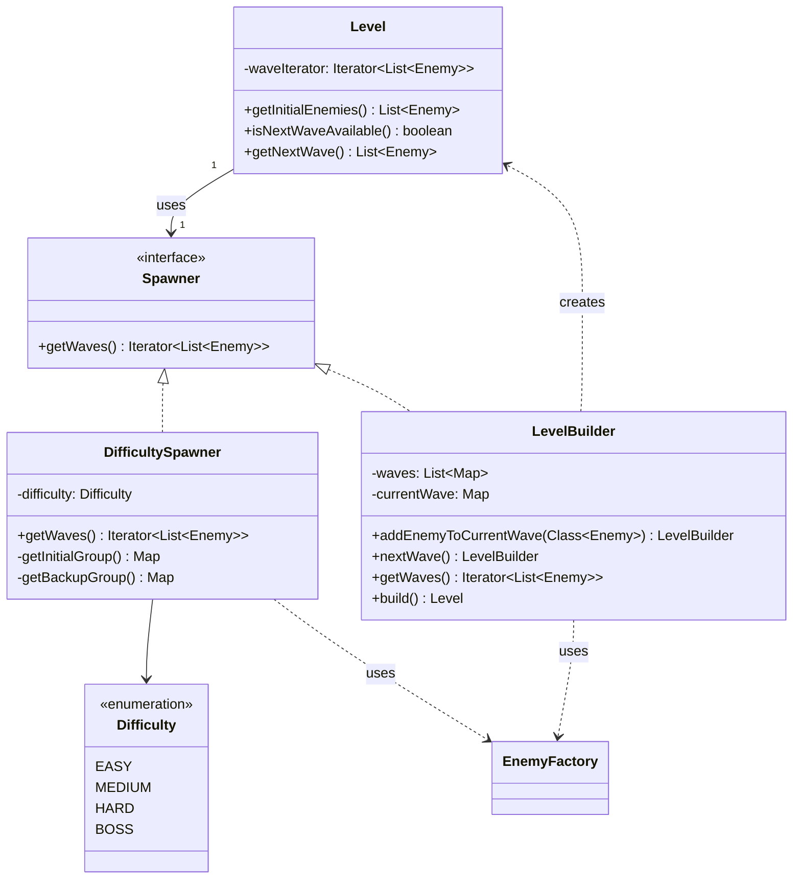

# Entity Level Module Class Diagram

The `entity.level` module handles the configuration of battle stages, including enemy wave generation and difficulty scaling.

### Module Responsibilities:
- **`Level`**: A runtime container for a battle's progression. It doesn't know *how* enemies are created, only how to request the next wave from its `Spawner`.
- **`Spawner` Hierarchy**: Employs the Strategy pattern to define different enemy generation algorithms.
- **`DifficultySpawner`**: Implements fixed wave logic based on the `Difficulty` level. It maps difficulties to specific enemy compositions and wave counts.
- **`LevelBuilder`**: A implementation of the Builder pattern that allows for programmatic construction of custom levels with multiple waves.
- **`Difficulty`**: A central enumeration used by the control layer and the level module to scale game challenge.
